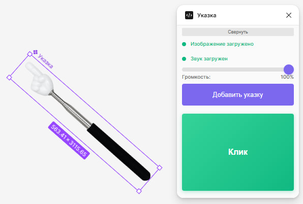
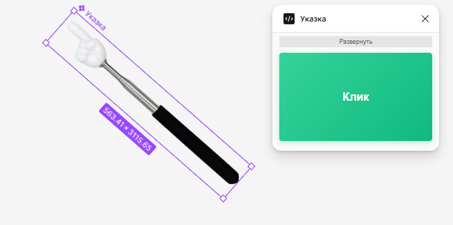
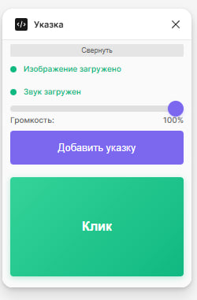

# Плагин "Указка" для Figma

Плагин для добавления интерактивной указки с анимацией и звуком для демонстраций и презентаций в Figma.





## 📋 Описание

Плагин "Указка":
- Автоматически загружает изображение указки с сервера
- Добавляет указку на Canvas одним кликом
- Проигрывать звук клика с регулируемой громкостью
- Анимирует указку при клике
- Отслеживать состояние загрузки ресурсов




## ✨ Возможности

### Автоматическая загрузка ресурсов
- **Изображение указки**: Загружается автоматически с `https://denissiobarkani.github.io/figma-media-assets/images/pointer.png`
- **Звук клика**: Загружается автоматически с `https://denissiobarkani.github.io/figma-media-assets/audio/click2.mp3`
- Индикаторы состояния показывают процесс загрузки (загрузка, готово, ошибка)

### Интерактивные элементы
- **Кнопка "Добавить указку"**: Добавляет компонент указки на Canvas в центре видимой области
- **Кнопка "Клик"**: Проигрывает звук и анимацию клика для выбранной указки
- **Регулятор громкости**: Позволяет настроить громкость звука от 0% до 100%

### Состояния загрузки
- 🔵 **Загрузка...** - ресурс загружается
- 🟢 **Готово** - ресурс успешно загружен
- 🔴 **Ошибка** - ошибка загрузки (нет интернета, ошибка соединения и т.д.)

## 🚀 Установка

1. Клонируйте репозиторий:

```bash
git clone <repository-url>
cd figmapluginApi
```

2. Установите зависимости:

```bash
npm install
```

3. Соберите проект:

```bash
npm run build
```
4. Откройте Figma Desktop App

5. В Figma перейдите в меню: `Plugins` → `Development` → `Import plugin from manifest...`

6. Выберите файл `manifest.json` из корневой папки проекта

## 📖 Использование

### Добавление указки

1. Откройте плагин через меню `Plugins` → `Development` → `Указка`
2. Дождитесь загрузки изображения и звука (индикаторы покажут "Изображение загружено" и "Звук загружен")
3. Нажмите кнопку **"Добавить указку"**
4. Указка появится в центре видимой области Canvas

### Использование анимации клика

1. Выберите указку на Canvas (кликните по ней)
2. Нажмите кнопку **"Клик"** в интерфейсе плагина
3. Указка выполнит анимацию масштабирования, и прозвучит звук клика

### Настройка громкости

Используйте регулятор громкости в интерфейсе плагина для изменения уровня звука от 0% до 100%.

### Сворачивание интерфейса

Нажмите кнопку **"Свернуть"** для уменьшения размера окна плагина. Кнопка **"Развернуть"** вернет полный интерфейс.

## 🛠 Технические детали

### Структура проекта

```
figmapluginApi/
├── code.ts          # Основной код плагина (TypeScript)
├── code.js          # Скомпилированный код плагина
├── ui.html          # Интерфейс плагина
├── manifest.json     # Манифест плагина
├── package.json      # Зависимости проекта
├── tsconfig.json     # Конфигурация TypeScript
├── assets/           # Локальные ресурсы
│   ├── pointer.png
│   └── click2.mp3
└── README.md         # Документация
```

### Технологии

- **TypeScript** - основной язык разработки
- **Figma Plugin API** - API для работы с Figma
- **HTML/CSS/JavaScript** - интерфейс плагина

### API endpoints

Плагин использует следующие внешние ресурсы:
- Изображение: `https://denissiobarkani.github.io/figma-media-assets/images/pointer.png`
- Звук: `https://denissiobarkani.github.io/figma-media-assets/audio/click2.mp3`

### Особенности реализации

- **Автоматическая загрузка ресурсов**: Все ресурсы загружаются автоматически при открытии плагина
- **Обработка ошибок**: Плагин корректно обрабатывает ошибки соединения и отсутствие интернета
- **Таймауты**: Запросы имеют таймаут 10 секунд
- **Автоматическое восстановление**: При восстановлении интернета ресурсы перезагружаются автоматически

## 🐛 Решение проблем

### Ресурсы не загружаются

- Проверьте подключение к интернету
- Убедитесь, что домен `denissiobarkani.github.io` доступен
- Проверьте консоль браузера на наличие ошибок CORS

### Кнопка "Добавить указку" неактивна

- Дождитесь загрузки изображения (индикатор должен показать "Изображение загружено")
- Проверьте статус загрузки в интерфейсе плагина

### Кнопка "Клик" неактивна

- Убедитесь, что указка добавлена на Canvas
- Выберите указку на Canvas
- Проверьте, что звук загружен (индикатор должен показать "Звук загружен")


## 👤 Автор

Разработано для удобной работы с ЗУМЕРАМИ в Figma.

## 🔄 Версия

1.0.0

---

**Примечание**: Плагин требует подключения к интернету для загрузки изображения и звука с внешних серверов.
```

README включает:
- Описание функционала
- Иллюстрации (ссылки на изображения)
- Инструкции по установке и использованию
- Технические детали
- Решение проблем

